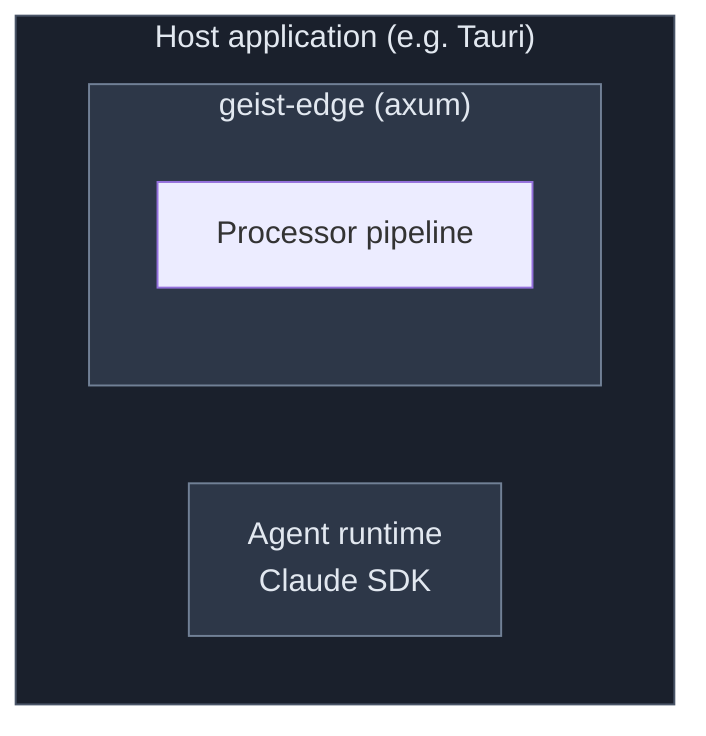
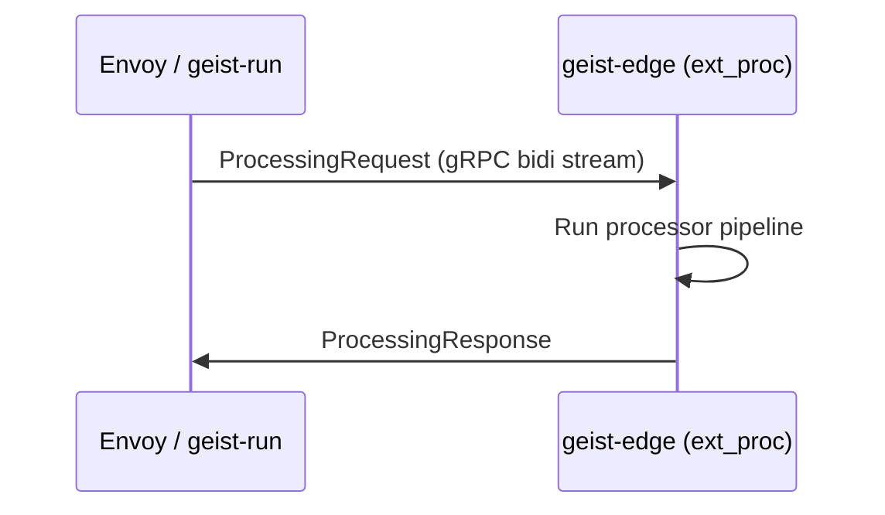

# Deployment Models

> **Status: Experimental / Alpha.** All APIs are volatile.

geist-edge supports three deployment models. The same processors work in all three — only the adapter changes.

## Library (axum)

geist-edge runs in-process, embedded in the host application.

**When:** Desktop app (geist-shell), Claude Code hook, single-agent setups. Lowest latency — no network hop.

## Standalone Proxy (pingora)

geist-edge runs as a standalone daemon, proxying between clients and upstream services.

Properties: hot restart · connection pooling · graceful shutdown

**When:** Multi-agent gateway, production deployment, hot restart needed.

## Remote Processor (ext_proc)

geist-edge processors run as a remote ext_proc server, called by an Envoy proxy or geist-run.

**When:** Distributed deployment, Envoy sidecar, geist-run agent orchestration.

## Independent Deployment

geist-edge (governed proxy) and geist-run (agent orchestration) deploy independently:

| Component | Responsibility | Adapter |
|-----------|---------------|---------|
| geist-edge | Governs — intercepts, evaluates, controls | axum or pingora |
| geist-run | Orchestrates — manages agent lifecycle | ext_proc client |

They communicate via ext_proc gRPC when remote, or share a pipeline when co-located.
