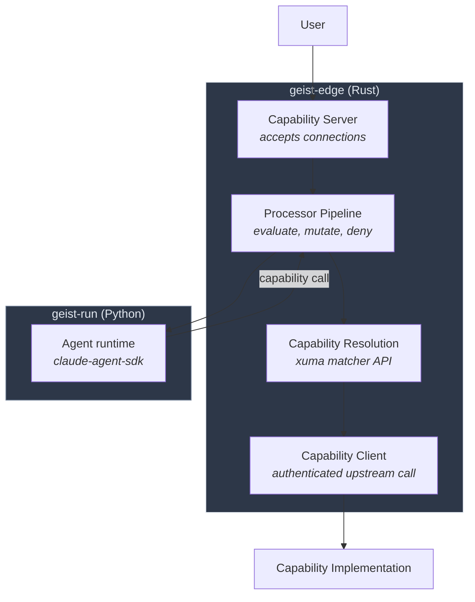
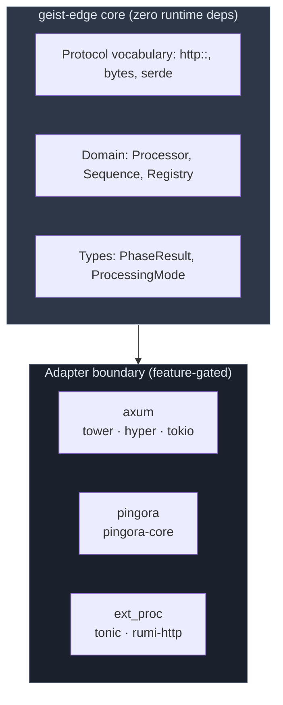

# Architecture Overview

> **Status: Experimental / Alpha.** All APIs are volatile.

## The Invariant

Everything transits the mediation plane. No exceptions.

geist-run cannot reach capabilities directly. It has no addresses to route to — the routing table lives in geist-edge. This is structural, not policy.

## System Architecture

geist-edge does three things:

1. **Capability server** — accepts inbound connections from users and capability calls from geist-run
2. **Capability resolution** — xuma (unified matcher API). Given a capability name, find the implementation. Deterministic, not LLM-dependent.
3. **Capability client** — executes the authenticated call to the upstream implementation

## Hexagonal Boundary

geist-edge core has zero runtime dependencies. Runtime adapters are feature-gated.

`http::` is protocol vocabulary — zero runtime dependencies, lives in core. Same as `serde` for serialization.

## Security Model

Three layers of defense in depth:

| Layer | Mechanism | Scope |
|-------|-----------|-------|
| Architectural | geist-run has no capability addresses | Sufficient for local-first |
| Network | NetworkPolicy restricts geist-run egress to edge only | Cloud-native |
| Identity | mTLS — capabilities only accept edge's certificate | Production |

Each layer is independently sufficient. All three apply in production.

## Crate Layout

| Crate | Path | Role |
|-------|------|------|
| `geist-edge` | `geist/edge` | Mediation plane — Processor trait, compositor, registry |
| `geist-sh` | `geist/bin` | Binary — composition root, starts adapter |

External: [**slickit**](https://github.com/mox-labs/slick) (Apache-2.0) — typed extension registry (`TypedConfig`, `TypedRegistry<T, E>`).

## The Wire

geist-edge ↔ geist-run: bidi streaming gRPC over HTTP/2, following the Envoy ext_proc pattern.

| Property | Why |
|----------|-----|
| Process isolation | Blocked LLM call doesn't take down the gateway |
| Typed messages | Structured, interceptable, full metadata |
| mTLS native | Security at the transport layer |
| Swappable | The proto is the contract — swap the Python runtime, keep the proto |
