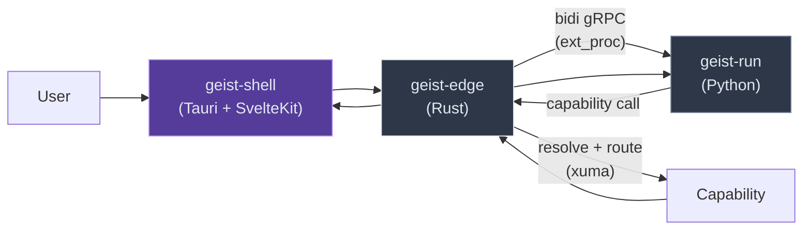

# geist.sh

> **Status: Experimental / Alpha.** All APIs are volatile and subject to breaking changes.

Desktop AI collaborator for knowledge workers. A packaged app where users set up their collaborator(s), backed by a governed runtime that makes composition safe.

One invariant: **everything transits the mediation plane.**

## Three Components



**geist-shell** — Tauri desktop container with SvelteKit frontend. The experience layer. Where users set up collaborators, share intent, and see results. The architecture is invisible to the user.

**geist-edge** — Rust microgateway. The mediation plane. Accepts connections, resolves capabilities via xuma, routes to implementations. Holds credentials, routing table, contracts. Observability is architectural — every capability call transits edge.

**geist-run** — Python application on claude-agent-sdk. The agent runtime. Receives intent, makes capability calls through edge. Never holds credentials. Never reaches capabilities directly.

geist-edge and geist-run communicate over bidi streaming gRPC (ext_proc pattern). Separate processes, separate failure domains. geist-shell embeds geist-edge in-process via the axum adapter.

## What This Gives You

| Property | How |
|----------|-----|
| Observability | Every capability call transits edge. No instrumentation needed. |
| Credential isolation | Keys live at edge. geist-run never holds them. |
| Governance | Processor pipeline evaluates every call. Deny-first. |
| Hot reload | Capability config changes apply without restart. |

These are architectural properties, not features you bolt on.

## The Stack

| Component | Language | Role |
|-----------|----------|------|
| geist-shell | Tauri, SvelteKit, or cloud-native (exploring) | Experience — user-facing interface |
| geist-edge | Rust | Mediation plane — capability server, resolver, client |
| geist-run | Python (claude-agent-sdk) | Agent runtime — intent, reasoning, capability calls |

## Quick Start

```bash
cargo test --workspace
```
