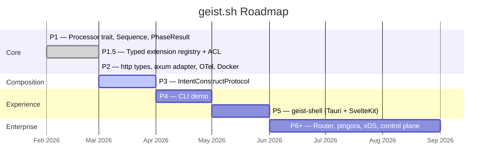

# Roadmap

> **Status: Experimental / Alpha.** All APIs are volatile and subject to breaking changes.

## Implementation Phases



## Phase Details

### P1 — Core Runtime ✓

geist-edge core: Processor trait (`&self`, `BoxFuture`), Sequence compositor, `PhaseResult`, `ProcessingMode`. Hexagonal architecture — zero runtime deps in core.

**67 tests.**

### P1.5 — Extension Registry ✓

Typed extension registry (`TypedConfig`, `TypedRegistry`) + access control processor. Processors self-register via `inventory::submit!` — zero code changes to core or binary. Deny-first ACL with rumi matchers compiled at construction.

**40 tests. 3 PRs: registry, access-control, composition root.**

### P2 — Governed Proxy ✓

Processor trait refactored to `http::` types (`&http::request::Parts`). Axum adapter (feature-gated). OTel tracing with per-processor spans. Dockerfile + docker-compose (geist-edge + Jaeger).

```bash
docker compose up -d
curl http://localhost:3000/                              # 200 — pipeline passed
curl -H "x-geist-agent-id: rogue" http://localhost:3000/ # 403 — ACL denied
# Jaeger UI: http://localhost:16686
```

**48 tests.**

### P3 — IntentConstructProtocol

The composition model evolves from linear Sequence to DAG. Key shifts:

| From (P2) | To (P3) |
|-----------|---------|
| Processor trait (4 phase methods) | Component trait (single `process`) |
| `&http::request::Parts` | Construct with intent-level enrichments |
| Linear chain | DAG with consumes/produces validation |
| Request/response | Reactive signal streams (intent → outcome) |
| Bolted-on OTel spans | Structural observability from composition |

**Component** — one trait across HTTP, CLI, in-process, agent workflows. Protocol-agnostic. Declares `consumes`/`produces` for design-time DAG validation.

**Construct** — the thing under construction. Accumulates enrichments as components process intent signals into outcome signals. The outcome stream is the Construct being built in real time.

**Reactive signals** — Mono (single intent/outcome = HTTP request/response) is the degenerate case. Flux (streaming intent/outcome = agentic, steerable) is the real model.

**Steerability** — circuit establishment pattern. Initial intent traverses DAG, components register streams. Client steers via input stream, edge demuxes to components, output aggregated via mux.

### P4 — CLI Demo

Compose → configure → edge → agent session. Same Component trait, CLI adapter instead of HTTP.

### P5 — geist-shell

Tauri desktop container. SvelteKit frontend. geist-edge embedded in-process via axum adapter.

### P6+ — Enterprise

- Router compositor (content-based routing)
- pingora adapter (hot restart, multi-agent gateway)
- ext_proc adapter (remote components over gRPC bidi)
- xDS transport (ECDS for dynamic processor config)
- Control plane

## Architecture Direction

See [`.claude/envisioning/streaming-composition-protocol.md`](https://github.com/mox-labs/geist.sh/blob/main/.claude/envisioning/streaming-composition-protocol.md) for the full IntentConstructProtocol design.
